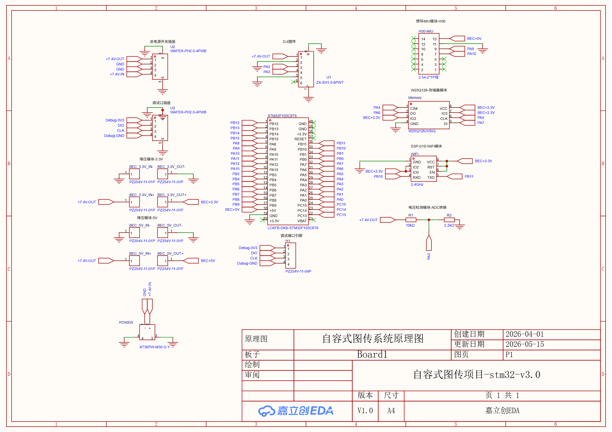

# 自容式图传子系统 (Self-contained Video Transmission Subsystem)


## 📌 项目简介

本项目为研究生阶段开发的**自容式图传子系统**。系统作为独立的视频回传单元，在电源、信号与控制链路上与无人机主控（飞控）实现了完全隔离，大幅提升了跨介质航行器或无人机系统在极端工况下的故障隔离能力。

系统以 **DJI O4 Air Unit** 为核心，搭配基于 STM32 的独立 OSD（On-Screen Display）信号源与电源管理模块，实现了不依赖飞控直连的图传回传，并将关键传感器信息叠加显示在 FPV 眼镜（如 DJI Goggles 2）中。

## ✨ 核心特性

* **高可靠性物理隔离**：图传子系统与主控在电源和数据链路上解耦，主控宕机不影响视频与关键状态的回传。
* **自定义 OSD 信息叠加**：基于 MSP (MultiWii Serial Protocol) 协议与 DJI 图传通信，将底层传感器数据打包发送至天空端并进行 OSD 渲染。
* **多模态数据采集**：
  * **电池监控**：通过 ADC 实时采集 2S 锂电池电压，保障供电安全。
  * **姿态获取**：通过串口高效解析 H30 惯导（INS）数据。
  * **数据存储与无线传输**：通过硬件 SPI 驱动 W25Q128 闪存芯片，并集成 WiFi 模块实现关键数据的无线传输与备份。

## 📂 目录结构

```text
├── ADC转换读取2S锂电池电压/          # 2S 电池电压 ADC 采样与滤波算法
├── MSP协议stm32与大疆图传通信/       # MSP V1/V2 协议封包与 UART 发送逻辑
├── 串口通信读取H30惯导数据/          # H30 惯导模块串行数据接收与协议解析
├── 硬件SPI读写W25Q128/               # W25Q128 Flash 存储器底层驱动 (SPI)
├── 硬件SPI读写W25Q128加WiFi传输/     # 本地存储与 WiFi 模块数据流转综合工程
└── README.md                         # 项目说明文档

## 📐 硬件实现 (Hardware Implementation)

### 1. 电路原理图
系统核心逻辑涵盖了 STM32 最小系统、2S 锂电池分压采样电路以及与 DJI O4 天空端的串口通信链路。
<div align="center">
  
  <p>图 1：基于 STM32 与 DJI O4 的系统原理图</p>
</div>
